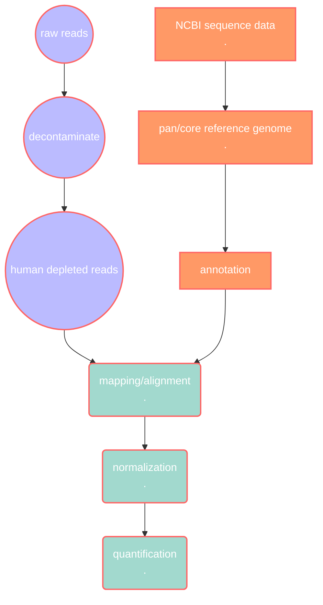

# RNA-seq analysis pipeline for *Pseudomonas aeruginosa* using pangenome reference

This is an attempt to build a RNA-seq analysis pipeline for P. aeruginosa using a pangenome reference.




## Introduction
WIP

## Pan/core genome reference

### Overview

#### File structure

```bash

00_data
# nucleotide and amino acid sequences of 21 PA strains
# nuc from ncbi, aa from pseudomonas.com

01_prokka
# result files from prokka, gff files are used for roary
# only files from prokka seem to work with roary??

02_roary
# roary results from prokka gff files
# reference pangenome

03_clean_ref
# coregenome needs to be extracted
# replaced prokka ids with PAtags from gff files
# blast remaining unlabelled seqs
# replace remaining with first hit

```

### Data collection

21 strains of *Pseudomonas aeruginosa* (PA) organisms from KEGG GENOME Database were used. The genome data were collected from GenBank 
through the link provided by the KEGG record, and their corresponding protein sequence data were downloaded from [pseudomonas.com](http://pseudomonas.com). 

[Record of PA strains](00_data/PA_strains.csv)

Retrieving files with URLs:

```bash
# download genome assembly from ncbi
wget -i PA_genome_list.txt

# get protein sequence files from pseudomonas.com
wget -i PA_AA_list.txt
```

### Creating a pangenome

```bash
# SOME PREAMBLE ABOUT RENAMING FILES:

# rename AA protein files with loop
# first remove the Pseudomonas_aeruginosa_ and keep the strain names for easy ref
ls Pseudomonas* | while read line; do mv ${line} ${line#P*nosa_} ; done
# then add the corresponding genome assembly file name (genbank assembly ID) done manually , no loops for this

# make a list of all genbank genome ids
ls GCA* > genome_list.txt
# extract just the id
sed s/(.*.[12])_.*_.*.fna/1/ genome_list.txt > genome_list.txt
# add the strain names to ids manually, use underscore to join
# rename AA protein files by adding the genbank ids
cat strain_id.txt | while read line; do AA=$(echo ${line:16}.faa); mv ${AA} ${line}.faa ; done

# simplify the .faa headers for prokka
sed 's/ref|.*|//' Pseudomonas_aeruginosa_PAO1_107.faa
```

#### Prokaryotic genome annotation

- **Prokka**
    - version 1.14.6
    - installed with conda version 4.12.0

```bash
# running prokka ### looped
for f in 00_data/*cleaned.faa ; do prokka --kingdom Bacteria --outdir 01_prokka/$(basename ${f} _cleaned.faa) --genus Pseudomonas 
--notrna --proteins ${f} --cpus 8 --prefix $(basename ${f} _cleaned.faa) ${f:0:15}*genomic.fna ; done

```

#### Creating the pangenome

- **Roary**
    - version 3.13.0
- module installed on lunar aurora

```bash

# run roary: 8 threads, verbose, use mafft
roary -p 8 -v -e --mafft *.gff
```

### Creating reference genomes

#### Extracting the core genome

The file `gene_presence_absence.csv` contains information for each gene in the pangenome and which strains contains it. This is 
used to extract the list of gene names in the core genome, which is then used with the python script `fix_pan_core.py` to create 
the reannotated core genome.

```bash
 # extracting core genome
awk 'BEGIN {FS="\""}; {if ($8==21) print $2}' gene_presence_absence.csv > list_coregene
```

#### Reference genome reannotation

- python scripts:
    - fix_pan_core.py
    - moblast_annot.py
        - (combine the `awk` process into `fix_pan_core.py` ?)
        - (combine both py scripts?)

#### - Reannotate with PAtags

The reference pangenome file from roary is in a fasta format, with each sequence header containing a unique prokka assigned ID and 
a gene name. Most of the gene names are also named as group_???? by prokka, and since these do not provide much information about 
the sequences, these will need to be reannotated. The .gff files from prokka, which were used in roary, also contain the PA tags, 
and these files will be used with the  `fix_pan_core.py` script to update the prokka IDs with PA tags that can be searched on 
pseudomonas.com

There are some sequences which would not have PA tags from the gff files, these sequences will be saved in another file which can 
be put into diamond later.

```bash
# for lunarc aurora cluster: try biopython
module add GCC/7.3.0-2.30 OpenMPI/3.1.1
module add Biopython/1.73-Python-3.6.6

# extracting core genome
awk 'BEGIN {FS="\""}; {if ($8==21) print $2}' gene_presence_absence.csv > list_coregene

# run script to update prokka IDs and create coregenome from list_coregene
python fix_pan_core.py

# if using fix_pangenome_v1.py and create coregenome with seqtk
module add seqtk/1.2
seqtk subseq pan_genome_reference_simpleheader.fa list_coregene > coregenome.fa

```

#### - More annotations

The file of sequences that were not updated are searched through all 21 of the previously downloaded `.faa` protein files from 
[pseudomonas.com](http://pseudomonas.com) with `diamond blastx` 

- diamond blast
    - version 2.1.4
    - installed with conda version 4.12.0 on lunarc aurora
    
    ```bash
    # make diamond database from all PA.faa files
    cat *.faa > all_PA.faa
    diamond makedb --in all_PA.faa --db PA_db --log
    
    # run diamond blastx ()
    diamond blastx -d PA_db.dmnd -q ../notags_seqs_pan_genome_reference.fa -f 6 -o notag_seqs.out
    ```
    

The diamond blast results output file is used to find the sequences that matched and the first hit for each sequence with identity 
\> 70% and  e-value < 0.001.

Using `moblast_annot.py` , the prokka IDs in the reference genome are updated with the new PA tags found by diamond blast.

```bash
# run moblast_annot.py
python moblast_annot.py
```

### Exploring the reference genome


- check R if they can make plots like the one from krona

```bash
python roary_plots.py tree.file gene_presence_absence.csv --format pdf --labels
```


### Reproducibility

- **GNU Wget:** version 1.14 built on linux-gnu
- **Prokka:** version 1.14.6
- **Roary:** version 3.13.0
- **DIAMOND**: version 2.1.4
- **seqtk:** version 1.2
- **GNU Awk:** version 4.0.2
- **Python:** version 3.6.6
