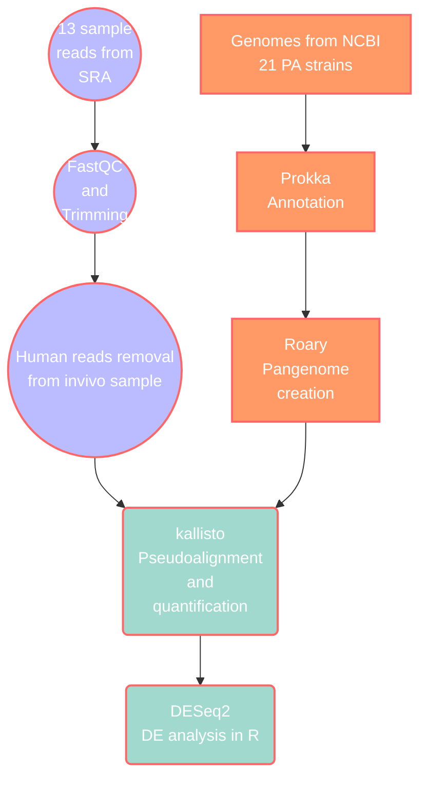

### Steps in the RNA-seq analysis of P. aeruginosa using a pangenome and PAO1 reference 
This is the documentation of codes and steps used during the BINP51 project: an overview of the pipeline is shown in the chart below and detailed steps follow below. All steps were executed using command line, except for the differential expression analysis which was done with R programming language. 





## Pangenome creation 

### Overview


```bash

# Overview of file structure to keep things organised

00_data
# nucleotide and amino acid sequences of 21 PA strains
# nuc from ncbi, aa from pseudomonas.com

01_prokka
# result files from prokka, gff files are used for roary
# only files from prokka seem to work with roary??

02_roary
# roary results from prokka gff files
# reference pangenome

03_clean_ref
# coregenome needs to be extracted
# replaced prokka ids with PAtags from gff files
# blast remaining unlabelled seqs
# replace remaining with first hit

```

### Data collection

21 strains of *Pseudomonas aeruginosa* (PA) organisms listed in the KEGG GENOME Database were used. The genome data were collected from NCBI through the link provided by the KEGG record, and their corresponding protein sequence data were downloaded from [pseudomonas.com](http://pseudomonas.com). 


```bash
# Download genome assembly from ncbi
wget -i PA_genome_list.txt

# Protein sequence files from pseudomonas.com
wget -i PA_AA_list.txt

# txt files contains a list of urls for dowlaods 
```

### Creating a pangenome

```bash
# SOME PREAMBLE ABOUT RENAMING FILES:

# rename AA protein files with loop
# first remove the Pseudomonas_aeruginosa_ and keep the strain names for easy ref
ls Pseudomonas* | while read line; do mv ${line} ${line#P*nosa_} ; done
# then add the corresponding genome assembly file name (genbank assembly ID) done manually , no loops for this

# make a list of all genbank genome ids
ls GCA* > genome_list.txt
# extract just the id
sed s/(.*.[12])_.*_.*.fna/1/ genome_list.txt > genome_list.txt
# add the strain names to ids manually, use underscore to join
# rename AA protein files by adding the genbank ids
cat strain_id.txt | while read line; do AA=$(echo ${line:16}.faa); mv ${AA} ${line}.faa ; done

# simplify the .faa headers for prokka
sed 's/ref|.*|//' Pseudomonas_aeruginosa_PAO1_107.faa
```

#### Prokaryotic genome annotation

- **Prokka**
    - version 1.14.6
    - installed with conda version 4.12.0

```bash
# running prokka ### looped
for f in 00_data/*cleaned.faa ; do prokka --kingdom Bacteria --outdir 01_prokka/$(basename ${f} _cleaned.faa) --genus Pseudomonas 
--notrna --proteins ${f} --cpus 8 --prefix $(basename ${f} _cleaned.faa) ${f:0:15}*genomic.fna ; done

```

#### Creating the pangenome

- **Roary**
    - version 3.13.0
- module installed on lunar aurora

```bash

# run roary: 8 threads, verbose, use mafft
roary -p 8 -v -e --mafft *.gff
```

### Creating reference genomes

#### Extracting the core genome

The file `gene_presence_absence.csv` contains information for each gene in the pangenome and which strains contains it. This is 
used to extract the list of gene names in the core genome, which is then used with the python script `fix_pan_core.py` to create 
the reannotated core genome.

```bash
 # extracting core genome
awk 'BEGIN {FS="\""}; {if ($8==21) print $2}' gene_presence_absence.csv > list_coregene
```

#### Reference genome reannotation

- python scripts:
    - fix_pan_core.py
    - moblast_annot.py

#### - Reannotate with PAtags

The reference pangenome file from roary is in a fasta format, with each sequence header containing a unique prokka assigned ID and 
a gene name. Most of the gene names are also named as group_???? by prokka, and since these do not provide much information about 
the sequences, these will need to be reannotated. The .gff files from prokka, which were used in roary, also contain the PA tags, 
and these files will be used with the  `fix_pan_core.py` script to update the prokka IDs with PA tags that can be searched on 
pseudomonas.com

There are some sequences which would not have PA tags from the gff files, these sequences will be saved in another file which can 
be put into diamond later.

```bash

# extracting core genome
awk 'BEGIN {FS="\""}; {if ($8==21) print $2}' gene_presence_absence.csv > list_coregene

# run script to update prokka IDs and create coregenome from list_coregene
python fix_pan_core.py

# if using fix_pangenome_v1.py and create coregenome with seqtk
seqtk subseq pan_genome_reference_simpleheader.fa list_coregene > coregenome.fa

```

#### - More annotations

The file of sequences that were not updated are searched through all 21 of the previously downloaded `.faa` protein files from 
[pseudomonas.com](http://pseudomonas.com) with `diamond blastx` 

- diamond blast
    - version 2.1.4
    - installed with conda version 4.12.0 on lunarc aurora
    
    ```bash
    # make diamond database from all PA.faa files
    cat *.faa > all_PA.faa
    diamond makedb --in all_PA.faa --db PA_db --log
    
    # run diamond blastx ()
    diamond blastx -d PA_db.dmnd -q ../notags_seqs_pan_genome_reference.fa -f 6 -o notag_seqs.out
    ```
    

The diamond blast results output file is used to find the sequences that matched and the first hit for each sequence with identity 
\> 70% and  e-value < 0.001.

Using `moblast_annot.py` , the prokka IDs in the reference genome are updated with the new PA tags found by diamond blast.

```bash
# run moblast_annot.py
python moblast_annot.py
```

### Exploring the reference genome
- Using the script from roary [link](https://github.com/sanger-pathogens/Roary/blob/21ffb84504fd55d256eca90a47e3f2f5a9012c5c/contrib/roary_plots/roary_plots.py) to explore the pangenome with plots.

```bash
python roary_plots.py tree.file gene_presence_absence.csv --format pdf --labels
```
### Other pangenome subsets
Number of strains in each genome according to roary, only soft-core was used in the project:
- soft-core: strains==20 
- accessory/shell: 4 ≤ strains ≤ 19 
- cloud: strains ≤ 3 


#### Creating soft-core, shell, cloud genomes

Clean up the pan genome header for seqtk to work:

```bash
sed 's/>.*\s\(.*\)/>\1/' pan_genome_reference.fa > pan_genome_reference_simpleheader.fa
```

Extract the gene names from gene_presence_absence.csv and retrieve the sequences from the pan genome (with simple headers)

```bash

#make lists for genomes

awk 'BEGIN {FS="\""}; {if ($8==20) print $2}' ../gene_presence_absence.csv > list_softcore
awk 'BEGIN {FS="\""}; {if ($8<=3) print $2}' ../gene_presence_absence.csv > list_cloudgene
awk 'BEGIN {FS="\""}; {if ($8<=19 && $8>3) print $2}' ../gene_presence_absence.csv > list_shell


# use seqtk subseq to extract the genes listed into another .fa file
seqtk subseq ../pan_genome_reference_simpleheader.fa list_softcore > softcore_genes.fa
seqtk subseq ../pan_genome_reference_simpleheader.fa list_cloudgene > cloud_genes.fa
seqtk subseq ../pan_genome_reference_simpleheader.fa list_shell > shell_genes.fa

```

#### Reproducibility

- **GNU Wget:** version 1.14 built on linux-gnu
- **Prokka:** version 1.14.6
- **Roary:** version 3.13.0
- **diamond**: version 2.1.4
- **seqtk:** version 1.2
- **GNU Awk:** version 4.0.2
- **Python:** version 3.6.6
- **Anaconda3:** version 4.12.0

## Pre-processing raw reads

### Overview
```
# file structure for organisation and sanity sake
00_SRA_samples
01_fastqc
02_trimmed
03_kraken2
04_seqtk
05_bowtie2
06_samtools

```

#### FastQC

- version 0.12.1
- installed with conda version 23.3.1

```bash
# noextract will not extract zip files
fastqc --noextract -o fastqc seq_1.fastq.gz seq_2.fastq.gz 
```
#### TrimGalore
- version 0.6.10
- Adapter trimming for all raw reads and produce a fastqc report after the trim

```bash
# trim for adapters, min read length 25
trim_galore --cores 8 --fastqc --length 25 seq_1.fastq.gz
```
### Human reads removal from *in vivo* sample data
#### Kraken2

- version 2.1.1
- Database:
    - The database used for kraken2 was a pre-made index (dated 12/9/2022) from the standard collection containing archae, bacteria, plasmid and human data.
    - Index downloaded from: [https://benlangmead.github.io/aws-indexes/k2](https://benlangmead.github.io/aws-indexes/k2)
- Running Kraken2 for single-end reads
    
    ```bash
    
    # kraken single-end reads
    for f in ../*fastq.gz;
    do base_nm=$(basename ${f} .fastq.gz);
    
    kraken2 --use-names \
            --threads 64 \
            --db ../database/ \
            --gzip-compressed \
            --report ${base_nm}.report.kraken \
            --output ${base_nm}.kraken \
            ${f};
    echo "Finished run for ${base_nm} at $(date)";
    done
    ```
    

### Seqtk

- version 1.2
- using Kraken2 output files, extract list of sequence ids NOT assigned as 'Homo sapiens'
- use seqtk subseq command with list of non-human ids to extract reads from fastq files

```bash
# extract seq id into list
for file in ../*file1_001.kraken;
do bs_name=$(basename ${file} .kraken);
grep -v 'Homo sapiens' ${file} | cut -f2 > list_cleaned_${bs_name};
done
# seqtk subseq the listed ids from original fastq into new cleaned_fastq files
seqtk subseq ../20*/${bs_name}.fastq.gz list_cleaned_${bs_name} | gzip > cleaned_${bs_name}.fastq.gz;
done
```

### Bowtie2

- version 2.4.4
- Bowtie pre-made index *H. sapiens,* GRch37
- Running Bowtie2 for single-end (unpaired) reads, output .sam files
    
```bash

# bowtie2 single-end reads
for f in ../kraken/cleaning/*1_001.fastq.gz;
do bs_name=$(basename ${f} 1_001.fastq.gz);
bowtie2 -t -p 32 -x ../bowtie2/GRCh37/GRCh37 \
        -U ${f} \
        -S ${bs_name}.sam;
rm ${f};
echo "${bs_name} ...done at $(date)";
done
```
    

### SAMtools

- version 1.15.1
- SAMtools is utilised for the second step of removing human reads, filtering for reads unmapped to human genome using SAM output from bowtie2 and creating the final FASTQ files
- Running SAMtools for single-end reads, filter 

```bash

# with parameters for single-end reads
for f in ../bowtie2/cleaned*;
do bs_name=$(basename ${f} .sam);
# convert SAM to BAM
samtools view -b ${f} -o ${bs_name}.bam;
# filter for unmapped reads
samtools fastq -f 0x4 \
        -0 ${bs_name}1.fastq.gz \
        -s /dev/null -n ${bs_name}.bam;
echo " ${bs_name} ...done at $(date)";
done
```

#### Reproducibility
- **FastQC:** version 0.12.1
- **TrimGalore:** version 0.6.10
- **Kraken2:** version 2.1.1
- **seqtk:** version 1.2
- **bowtie2:** version 2.4.4
- **SAMtools:** version 1.15.1
- **conda:** version 23.3.1

## Pseudoalignment of reads

### kallisto 

- version 0.46.0
- module is also available on lunarc


- Using the created pangenome/core/soft-core genome from previous steps and a PAO1 reference from Pseudomonas.com, create the kallisto database index for each

- The `kallisto quant` command pseudoaligns the sample reads to the reference and outputs the results into their corresponding directories. This is repeated for each reference genome (i.e core, soft-core, pan, PAO1)


```bash

# repeat for all reference genomes
echo ">>>>>Starting step1: build kallisto index at $(date)"
kallisto index --make-unique -i PAO1_107.idx PAO1_107.ffn
echo "Done at $(date)"

echo ">>>>>Starting step2: kallisto quant at $(date)"

for f in SRA_samples/*fq.gz;
do bs_name=$(basename ${f} .fq.gz);
kallisto quant -i PAO1_107.idx \
        -t 16 \
        -o ${bs_name} \
        -b 100 \
        --single \
        -l 100 \
        -s 20 \
        ${f} ;
echo "${bs_name} ...done at $(date)";
done


```
