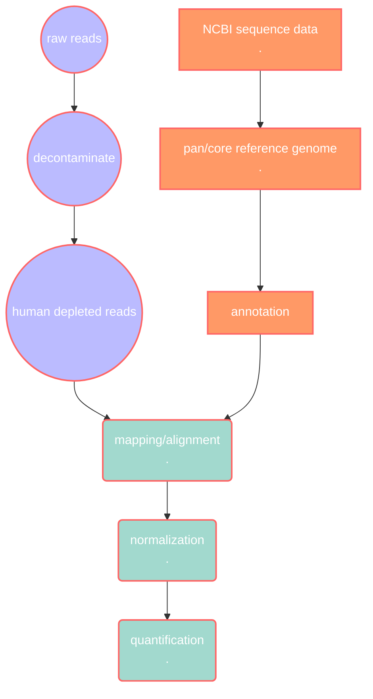
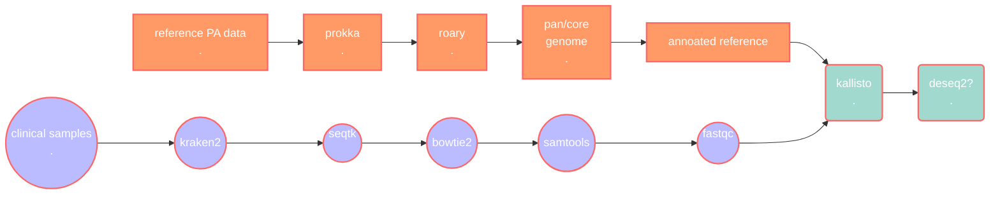

# pipeline notes

### bioinfo methods?

- comparing methods(?)how/why certain tools are chosen?:
    - decontamination process
    - pan/core genome softwares
        - why pan/core genome
        - compare with using PA reference PAO1 genome?
    - alignment softwares

version control/reproducibility: github

***how do these apply to PA?***

why not use established databases such as BACTOME?

- further(?):
    - reference-free *de novo* transcriptome?
    - metatranscriptomics?